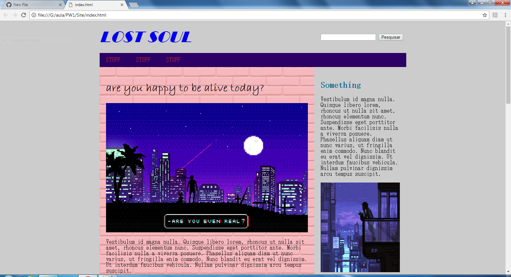

### Conteúdo - Técnicas de Programação para Internet I

Repositório oficial do componente curricular de Técnicas de Programação para Internet I

### HTML | CSS | JAVASCRIPT | GITHUB

### EXEMPLO DE CONSTRUÇÃO DE UM WEBSITE COM A UTILIZAÇÃO DE HTML, CSS E JAVASCRIPT

